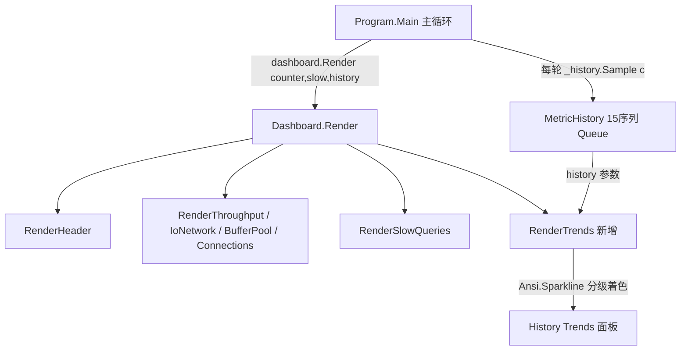

## 用户需求

基于现有 MySqlMonitor 命令行工具，使用 VB.NET 完善仪表盘的"历史趋势（sparkline）"特性。

## 产品概述

MySqlMonitor 是一个实时 MySQL 性能监控控制台工具，以全屏 ANSI 仪表盘展示查询吞吐、I/O、缓冲池、连接数、慢查询等。当前代码已采集 15 个指标的历史序列（MetricHistory）并传入 Dashboard，但 Dashboard 未使用这些历史数据。本特性将新增一个独立的「History Trends」面板，在慢查询面板下方集中展示所有指标的 sparkline 迷你趋势图。

## 核心特性

- 在仪表盘新增全宽「History Trends」面板，标题显示采样窗口（如 last 40 samples）。
- 将 15 个历史指标分为四组展示：Query Throughput（7 项）、I/O & Network（4 项）、InnoDB Buffer Pool（2 项）、Connections（1 项）。
- 每项一行：指标名称 + 当前值 + sparkline 趋势图。
- sparkline 复用现有 Ansi.Sparkline（Unicode 方块字符，自动缩放，ANSI 安全）。
- 趋势图颜色按当前值语义分级（复用现有 Ansi.GradeValue）：比率类（命中率/使用率）按阈值红/黄/绿，计数类按临界阈值分级。
- 窄终端自适应：sparkline 宽度随面板宽度收缩，保持面板边框可见宽度计算正确。

## 技术栈

- 语言：VB.NET（与现有项目一致）
- 渲染：纯 ANSI 转义序列（沿用 Ansi.vb 模块，无第三方 TUI 库）
- 项目：MySqlMonitor.vbproj（.NET，Windows/Ubuntu 控制台）
- 不引入新依赖、不修改 PerformanceCounter / LibMySQL / Program / MetricHistory / Ansi

## 实现方案

### 总体策略

采用"接线"方式：基础设施已齐备（MetricHistory 已采集 15 序列、Ansi.Sparkline 已实现、Render 已接收 history 参数）。只需在 Dashboard 中新增 `RenderTrends` 子程序，从 `history` 读取各序列，调用 `Ansi.Sparkline` 绘制，并将当前值经 `Ansi.GradeValue` 分级着色，最后在 `Render` 中慢查询面板之后调用。

### 关键技术决策

1. **复用 Ansi.Sparkline 而非自建**：其已实现线性重采样至固定宽度、min/max 自动缩放、空序列降级为 `·`、且保证"可见宽度 == 传入 width"，与 Dashboard 的 `VisibleLen`/`PadRaw` 列合并逻辑完全兼容，避免破坏现有双列布局。
2. **分组展示而非单行铺满**：15 项若单行平铺会超出窄终端宽度，按语义分组（Throughput/I/O/BufferPool/Connections）更清晰，也方便窄终端整组折行。
3. **颜色分级规则复用 GradeValue**：比率类（HitRate*100、Usage*100）沿用 BufferPool 面板已有阈值（90/95、75/90）；计数类（吞吐/连接）采用合理上限阈值分级，与现有"绿=好、黄=警告、红=危险"语义一致，无需新增配色函数。
4. **固定 sparkline 宽度**：按 `w - labelW - valW` 推算（约 w-30），不增加命令行参数，符合用户"固定即可"的选择。

### 性能与可靠性

- sparkline 渲染为 O(width) 字符串拼接，每帧 15 次，开销可忽略；histogram 序列上限 40 点，内存有界。
- 空历史（程序启动首帧）由 Ansi.Sparkline 降级为 `·` 处理，不会抛出异常。
- 不改 Program 主循环，采样与双缓冲写入逻辑不受影响，blast radius 控制在 Dashboard 单文件内。

## 实现注意事项

- `RenderTrends` 必须调用现有 `PanelStart/PanelLine/PanelEnd`，确保边框字符与现有面板一致。
- 窄终端（w < 60）时 sparkline 宽度需 `Math.Max(8, w - 30)`，避免负值或 0 宽导致 Sparkline 返回空串破坏布局。
- 当前值格式化复用现有 `FmtRate`/`FmtKBs` 及百分比格式，保持与上方面板数值单位一致。
- 不修改 MetricHistory 的 Capacity 常量；面板标题中的样本数直接引用 `MetricHistory.Capacity`。

## 架构设计

现有渲染链：Program 主循环采样 → MetricHistory.Sample → Dashboard.Render(counter, proc, slow, startTime, history) → 各 RenderXxx 面板子程序 → 字符串拼接一次写入控制台。

本次仅在 Dashboard 内追加一个面板子程序，不改变数据流与调用链：



## 目录结构

仅修改一个文件（接线式增强，符合最小改动原则）：

```
g:/graphQL/src/mysqli/MySqlMonitor/src/
└── Dashboard.vb          # [MODIFY] 1) 在 Render 内 RenderSlowQueries 之后调用 RenderTrends(sb, counter, history, w)
                          #            2) 新增 RenderTrends 子程序：PanelStart("History Trends (last 40 samples)")
                          #               分组读取 history.SelectSeries/InsertSeries/.../ConnsSeries，
                          #               每行用 FmtRate/FmtKBs/百分比格式化当前值，Ansi.GradeValue 分级着色，
                          #               调用 Ansi.Sparkline(series, sparkW, color) 绘制趋势，PanelLine 输出，PanelEnd 收尾。
                          #            3) 窄终端自适应：sparkW = Math.Max(8, w - 30)；保证可见宽度正确。
```

## 关键代码结构（示意，非实现体）

- `Dashboard.RenderTrends(sb As StringBuilder, c As Counter, history As MetricHistory, w As Integer)`：新增子程序签名。
- 分组项定义示例：`(label, seriesGetter, fmtFunc, gradeFunc)`，其中 `seriesGetter` 返回 `history.XxxSeries`，`gradeFunc` 用 `Ansi.GradeValue` 基于 `c` 当前值返回颜色 SGR 前缀。